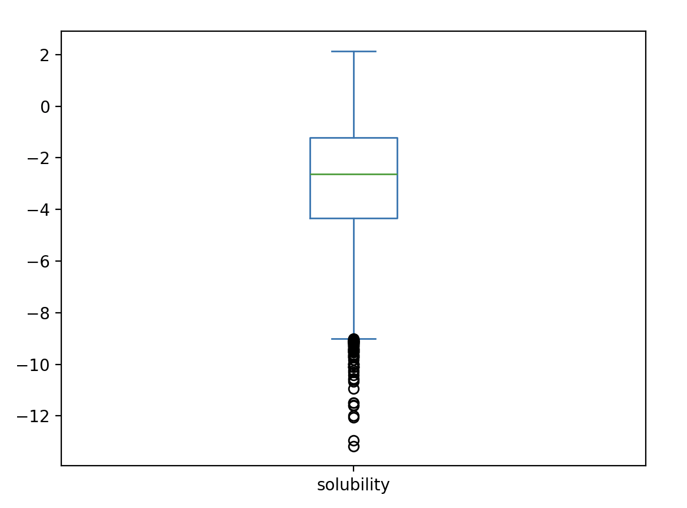
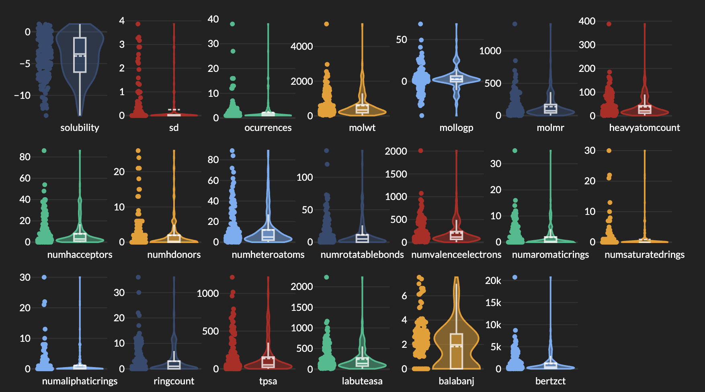
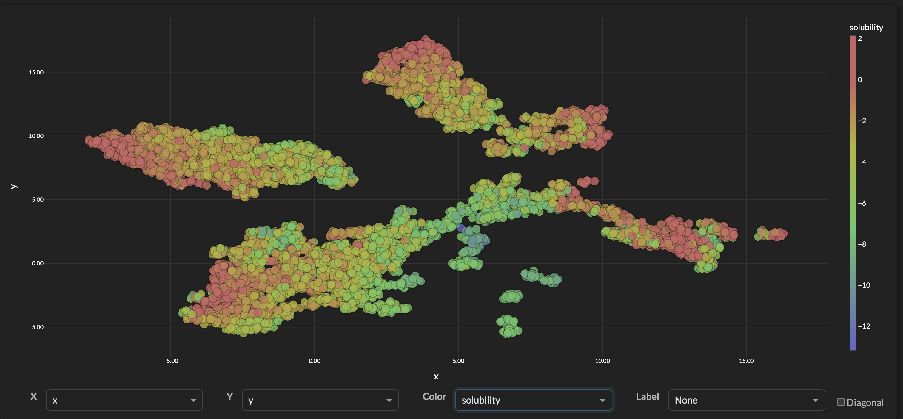
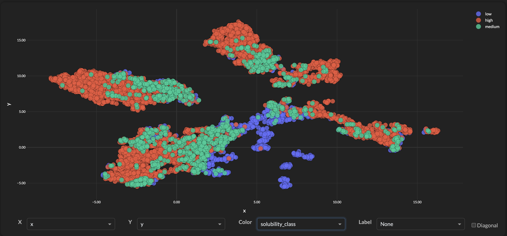
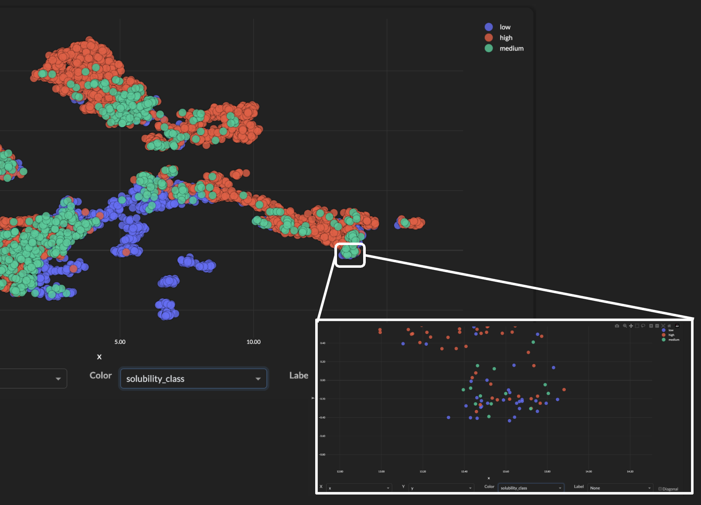

# AWS ML Engineer Capstone Project

Welcome to my capstone project for the Udacity AWS Machine Learning Course <https://www.udacity.com/enrollment/nd189>.

## Project Overview
For this project we're going to explore ways of computing confidence for regression model predictions. In particular we'd like to deploy 'sets of models' into AWS, ensembles for bootstrapping and quantile regression. Our model scripts and AWS endpoints will use groups of models and provide additional information like prediction intervals and quantile ranges. We're also going to compare/contrast these against a KNN model for regression confidence metrics.

## Datasets and Inputs
For this project, we're going to use the publicly available AqSol Database [1]. This is a curated reference set of aqueous solubility, created by the Autonomous Energy Materials Discovery [AMD] research group, consists of aqueous solubility values of 9,982 unique compounds curated from 9 different publicly available aqueous solubility datasets. AqSolDB also contains some relevant topological and physico-chemical 2D descriptors. Additionally, AqSolDB contains validated molecular representations of each of the compounds.

Data Download from the Harvard DataVerse: <https://dataverse.harvard.edu/dataset.xhtml?persistentId=doi:10.7910/DVN/OVHAW8>


## Problem Statement
Within the domain of **drug discovery**, data used for model training often comes from bench experiments where a property like solubility is measured. As part of the data collection, there is often **noise** associated with the measurement, differences in temperature, pH, and extraction procedures can lead to variability. Also compounds can hit activity cliffs (see [2][3][4]) where a small molecular change can lead to a significant difference in the response variable. For all of these scenarios, we'd like to provide a set of models that together will provide both a regression prediction and confidence score for each observation.

## Metrics
We'd like our confidence metric to capture areas in feature space where the model is more or less confident in it's predictions. In areas of high confidence we'd expect to have smaller errors and in areas of low confidence we'd expect to see larger errors. We'll use statistics and boxplots that capture the prediction errors.

The metrics will include standard descriptive statistics about each of the confidence 'bands' (low, medium, and high). 

- min/max
- mean
- stddev
- Q1, Q2, Q3, IQR

The delination of the confidence bands (low, medium, and high) will be as follows:

- **Low** (0.0 to 0.33)
- **Medium** (0.33 to 0.66)
- **High** (0.66 to 1.0)

The calculation of the confidence score will be domain specific, meaning that for our particular dataset and target values will look at the ensemble model outputs and determine a heuristic for a confidence score that ranges from 0.0 to 1.0.

# Analysis

## Data Exploration
**Dataset:** For this project, we're using the AQSol public data as a representative dataset. For more information and details please see [Datasets and Inputs](##datasets-and-inputs).

### Data Statistics
- **Rows:** 9982
- **Target Column:** solubility
- **Feature Columns:** 17
- **Features:** molwt, mollogp, molmr, heavyatomcount, numhacceptors, numhdonors, numheteroatoms, numrotatablebonds, numvalenceelectrons, numaromaticrings, numsaturatedrings, numaliphaticrings, ringcount, tpsa, labuteasa, balabanj, bertzct


**Target: solubility**
<table>
<tr>

<td>

</td>
<td>

```
fs.descriptive_stats()["solubility"]

Out[36]:
{'min': -13.1719,
 'q1': -4.318666603641981,
 'median': -2.6081432110925657,
 'q3': -1.213113009169698,
 'max': 2.1376816201,
 'mean': -2.8899088047869865,
 'stddev': 2.368154448407012}
``` 
 
</td>

</tr>
</table>

**Feature Distributions using Violin Plots**


**Sample Rows**

```
[●●●]Workbench:scp_sandbox> df[comp_columns]
Out[41]:
      solubility    molwt  mollogp     molmr  heavyatomcount  numhacceptors  ...  ringcount    tpsa   labuteasa      balabanj      bertzct  solubility_class
0      -5.921700  197.064  4.14660   53.9680            12.0            0.0  ...        2.0    0.00   80.719600  2.797846e+00   384.358135               low
1      -5.984242  236.270  3.02440   69.1270            18.0            2.0  ...        3.0   34.14  105.265479  2.268429e+00   668.547220               low
2      -6.384617  242.447  5.72400   77.5710            17.0            1.0  ...        0.0    9.23  109.326928  2.846262e+00   108.693586               low
3      -3.591300  421.422  1.62540   90.6954            27.0            5.0  ...        3.0  118.36  153.035266  2.108091e+00  1085.280492              high
4      -2.800100  100.014  1.99100   11.4580             6.0            0.0  ...        0.0    0.00   31.076732  3.675949e+00    55.617271              high
...          ...      ...      ...       ...             ...            ...  ...        ...     ...         ...           ...          ...               ...
9977   -3.951281  269.059  1.66150   56.1384            16.0            5.0  ...        1.0   74.44  100.246449  2.931415e+00   428.234717              high
9978   -1.657600  146.149  1.33540   41.2028            11.0            3.0  ...        2.0   46.01   63.346597  2.913161e+00   381.253771              high
9979   -1.020815  482.584  3.06140  121.8500            32.0           10.0  ...        3.0  127.73  190.866146  5.344871e-07  1146.856409              high
9980    0.938623  115.180  0.04437   35.1007             8.0            1.0  ...        0.0   30.33   50.404038  3.651234e+00    75.674572              high
9981   -6.964446  368.558  6.58950  107.4476            26.0            2.0  ...        0.0   74.60  159.624944  3.369474e+00   376.338537               low
```


## Exploratory Visualization
Our main goal here is to use AWS **ensemble** models to help us identify areas of feature space where the model has high or low confidence in its predictions. To help us visualize the feature space we'll use the UMAP[5] projection algorithm to project the 17 dimenional feature space down to 2.


<figure>
  
  <figcaption><em>UMAP 2D projection of 17 dimensional feature space showing logS solubility of each compound (n=9982)</em></figcaption>
</figure>

In the image above we can see that some areas have a relatively low target variance and standard regression models (like XGBRegressor) should be able to make relatively accurate predictions in those areas. We also some some areas with higher variance that may indicate compounds on activity cliffs, noisy experimental conditions, or simply erroneous solubility measurements.

**Using Solubility Classification Colors**

Although this project will strictly be using regression models, here we want to better illuminate the areas of feature space that have high variance by coloring the plot above with a "high, medium, and low" solubility values. For logS solubility those values are traditionally based on these ranges:

- **High Solubility**: > -4 logS
- **Medium Solubility:** > -5 and < -4 logS
- **Low Solubility:** < -5 logS

<figure>
  
  <figcaption><em>Same UMAP projection as above but colored by solubility classes to better illustrate areas of high variance</em></figcaption>
</figure>


<figure>
  
  <figcaption><em>Zooming into an area with high variability. Compounds show solubility from every category("low", "medium", and "high")</em></figcaption>
</figure>


## Algorithms and Techniques

1. **Prediction Intervals using Bootstrapping**
   - Bootstrapping involves repeatedly sampling from the training data and fitting the model multiple times to generate a distribution of predictions. This can be used to estimate prediction intervals. This approach should be robust and doesn't make assumptions about a particular distribution. 
  
1. **Quantile Regression**
   - A set of models with different objective functions that can provide quantile estimates for predictions. Combines the benefits of quantile regression and ensemble methods. We'll estimate a range of quantiles that should give us a 'spread' of target values within that region of feature space.

1. **Quantile Regression + Residuals Model**: This model will provide predictions at different quantiles, offering a broader sense of the distribution within the training data. It will help in understanding the range and variability of predictions. Included as part of this functionality is the computation of residuals for all of the observations (using 5-Fold Cross validation and aggregating the results).
1. **K-Nearest Neighbors (KNN) Model**: This model will use the distances to the nearest neighbors in the feature space. Observations that have close neighbors with low variance in their target values will have higher neighborhood 'quality' levels, while those in high variance neighborhoods or sparse regions will have lower quality levels.

These models and endpoints will be implemented using AWS SageMaker, leveraging its robust infrastructure for training, deploying, and scaling machine learning models.


## Benchmark Model

For the benchmark model, we'll use the AWS Linear Learner model. This model will provide point predictions without any data quality or confidence estimates, serving as a baseline to compare the performance against the evaluation metrics defined below.

## Evaluation Metrics

The performance of both the benchmark model and the proposed data quality models will be evaluated using the following metrics:

- **Mean Absolute Error (MAE)**: To measure the accuracy of the point predictions. We'll measure the benchmark model with ALL the data (80/20 split), and then we'll partition the data into 3 segments: high, medium, and low quality. The MAE on 80/20 splits will be provided for the 4 categories: all, high, med, and low.
- **ROC Curves/AUC**: Similar to the MAE, we provide a ROC curve plot (with AUC scores) for each of the 4 categories (all, high, med, low). Since ROC curves are traditionally used with classification data, we'll employ an 'Accurate' column that looks at the residuals and if they are less than some delta then we'll consider the prediction as an accurate prediction. **Example:** For LogS solubility we might define any prediction within 0.5 log units as being an accurate prediction. This will be a parameter that can be adjusted for different use cases.

## Project Design

The project will develop and implement data quality/confidence models within the AWS SageMaker environment.

1. **AQSol Public Data**: We'll use the Aqueous Solubility public dataset to provide an example of realistic data that contains inherent noise in the target variable (Solubility).

1. **Model Training**: Will use the AWS SageMaker model training functionality to train our two data quality models.
   - **Quantile Regression + Residuals**: Model to predict different quantiles of the target variable. This model will also compute residuals as described above.
   - **K-Nearest Neighbors (KNN) Model**: Develop a KNN-based model to estimate confidence levels based on the density and variability of observations in the feature space.

1. **Endpoint Deployment**: Deploy the models on AWS SageMaker, setting up endpoints for real-time predictions and confidence estimates.
1. **Model Evaluation**: Evaluate the models using the defined metrics, comparing them against the benchmark model.
1. **Visualization and Reporting**: Create visualizations to illustrate the distribution of predictions and confidence levels, and compile a comprehensive report documenting the findings and insights from the project.

By following this workflow, the project aims to deliver robust data quality/confidence models that enhance the interpretability and reliability of machine learning predictions in AWS.


# Project Rubric
This is the project rubric to make sure the project covers all the requirements.

## Definition
### Project Overview
Student provides a high-level overview of the project in layman’s terms. Background information such as the problem domain, the project origin, and related data sets or input data is given.

### Problem Statement
The problem which needs to be solved is clearly defined. A strategy for solving the problem, including discussion of the expected solution, has been made.

### Metrics
Metrics used to measure the performance of a model or result are clearly defined. Metrics are justified based on the characteristics of the problem.

## Analysis

### Data Exploration
If a dataset is present, features and calculated statistics relevant to the problem have been reported and discussed, along with a sampling of the data. In lieu of a dataset, a thorough description of the input space or input data has been made. Abnormalities or characteristics of the data or input that need to be addressed have been identified.

### Exploratory Visualization
A visualization has been provided that summarizes or extracts a relevant characteristic or feature about the dataset or input data with thorough discussion. Visual cues are clearly defined.

### Algorithms and Techniques
Algorithms and techniques used in the project are thoroughly discussed and properly justified based on the characteristics of the problem.

### Benchmark
Student clearly defines a benchmark result or threshold for comparing performances of solutions obtained.

## Methodology

### Data Preprocessing
All preprocessing steps have been clearly documented. Abnormalities or characteristics of the data or input that needed to be addressed have been corrected. If no data preprocessing is necessary, it has been clearly justified.

### Implementation
The process for which metrics, algorithms, and techniques were implemented with the given datasets or input data has been thoroughly documented. Complications that occurred during the coding process are discussed.

### Refinement
The process of improving upon the algorithms and techniques used is clearly documented. Both the initial and final solutions are reported, along with intermediate solutions, if necessary.

## Results

### Model Evaluation and Validation
The final model’s qualities—such as parameters—are evaluated in detail. Some type of analysis is used to validate the robustness of the model’s solution.

### Justification
The final results are compared to the benchmark result or threshold with some type of statistical analysis. Justification is made as to whether the final model and solution is significant enough to have adequately solved the problem.

# References
1. Sorkun, M. C., Khetan, A., & Er, S. (2019). *AqSolDB: A curated reference set of aqueous solubility and 2D descriptors for a diverse set of compounds*. Scientific Data, 6, 143. [https://doi.org/10.1038/s41597-019-0151-1](https://doi.org/10.1038/s41597-019-0151-1). Dataset: [https://doi.org/10.7910/DVN/OVHAW8](https://doi.org/10.7910/DVN/OVHAW8)

2. Wang, Z., Zhang, Y., & Xu, J. (2024). *Activity Cliff-Informed Contrastive Learning for Molecular Property Prediction*. PLoS Computational Biology. [PMC11643338](https://pmc.ncbi.nlm.nih.gov/articles/PMC11643338)

3. Stumpfe, D., & Bajorath, J. (2019). *Evolving Concept of Activity Cliffs*. ACS Omega, 4(1), 14360–14368. [https://doi.org/10.1021/acsomega.9b02221](https://pubs.acs.org/doi/10.1021/acsomega.9b02221)

4. Mayr, A., Klambauer, G., & Hochreiter, S. (2023). *Exploring QSAR Models for Activity-Cliff Prediction*. Journal of Cheminformatics, 15(1), 1–14. [https://doi.org/10.1186/s13321-023-00708-w](https://jcheminf.biomedcentral.com/articles/10.1186/s13321-023-00708-w)

5. McInnes, L., Healy, J., & Melville, J. (2018). *UMAP: Uniform Manifold Approximation and Projection for Dimension Reduction*. arXiv:1802.03426. [https://arxiv.org/abs/1802.03426](https://arxiv.org/abs/1802.03426). GitHub: https://github.com/lmcinnes/umap