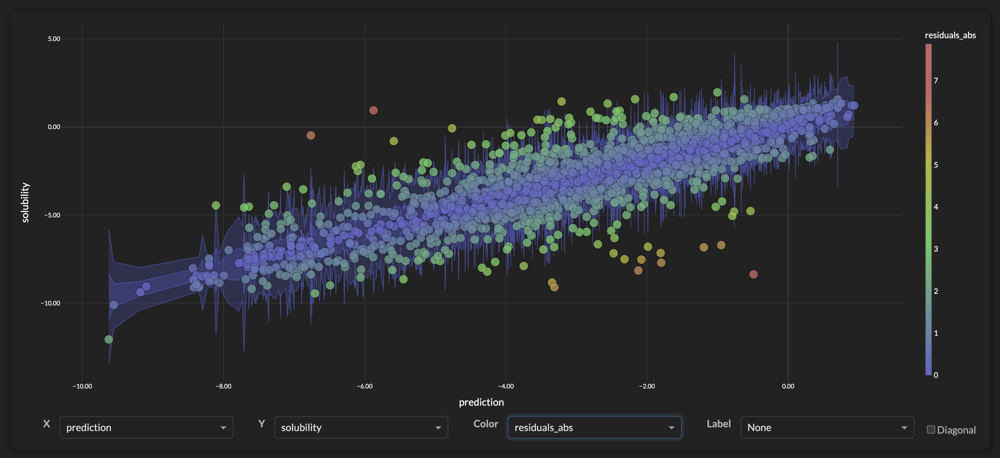
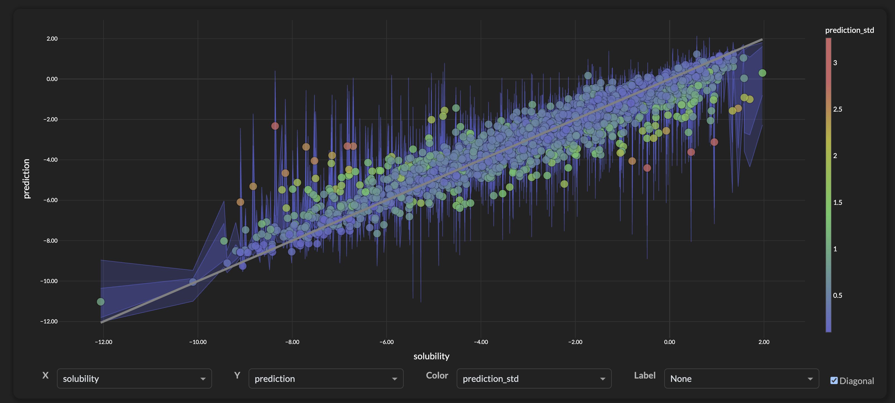
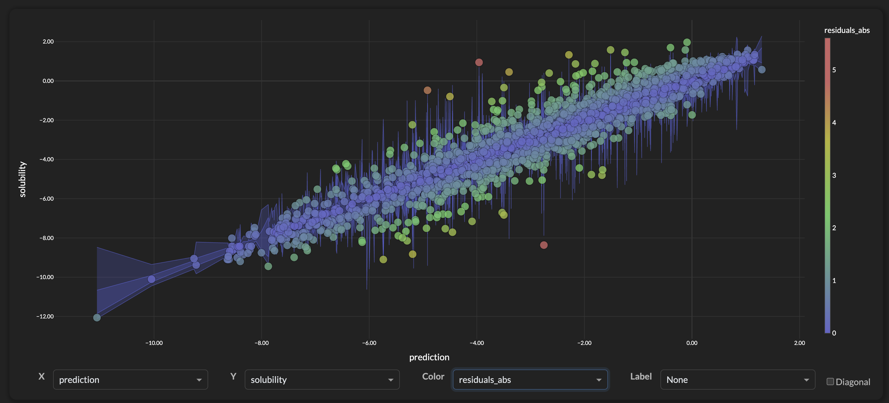

# AWS ML Engineer Capstone Project

Welcome to my capstone project for the Udacity AWS Machine Learning Course <https://www.udacity.com/enrollment/nd189>.

## Project Overview
For this project we're going to explore ways of computing uncertainty for regression model predictions. In particular we'd like to deploy a set of models into **AWS**, ensembles for bootstrapping, quantile regressors, and Uncertainly Quantification (UQ) models that include stddev or prediction intervals. Our model scripts and AWS endpoints will use these models to provide both a point prediction and additional information like standard deviation and prediction intervals.

### Project Goal
The goal for this project is to have an AWS model (or set of models) that gives us both point predictions and a set of uncertainly quantification metric associated with each prediction.

<figure>
  
  <figcaption><em>Regression with Uncertainly Quantification: Solubility point prediction and uncertainly metrics</em></figcaption>
</figure>


#### Uncertainty Quantification Algorithms Tested
Since we're going to be testing and experimented a lot of algorithms for this project, at the end we'll capture results and rank the models based on their performance for our use case.

1. **BayesianRidge Regressor**
1. **GaussianProcess Regressor**
1. **MAPIE**
1. **NGBoost**
1. **Bootstrap Ensemble**
1. **Quantile Regression**


## Datasets and Inputs
For this project, we're going to use the publicly available AqSol Database [1]. This is a curated reference set of aqueous solubility, created by the Autonomous Energy Materials Discovery [AMD] research group, consists of aqueous solubility values of 9,982 unique compounds curated from 9 different publicly available aqueous solubility datasets. AqSolDB also contains some relevant topological and physico-chemical 2D descriptors. Additionally, AqSolDB contains validated molecular representations of each of the compounds.

Data Download from the Harvard DataVerse: <https://dataverse.harvard.edu/dataset.xhtml?persistentId=doi:10.7910/DVN/OVHAW8>


## Problem Statement
Within the domain of **drug discovery**, data used for model training often comes from bench experiments where a property like solubility is measured. As part of the data collection, there is often **noise** associated with the measurement, differences in temperature, pH, and measurement procedures can lead to variability. Also compounds can hit activity cliffs (see [2][3][4]) where a small molecular change can lead to a significant difference in the response variable. For all of these scenarios, we'd like to provide a set of models that supplement a regression prediction with a 'confidence' metric for each observation. The confidence metrics are directly tied to varibility of the target value within feature space. So areas of high variability (stddev or large quantile spread) will have a lower confidence and areas that are 'smooth' (low variability/low spread) will have higher confidence.

## Metrics
We'd like our confidence metric to capture areas in feature space where the model is more or less confident in it's predictions. In areas of high confidence we'd expect to have smaller residuals and in areas of low confidence we'd expect to see larger residuals.

We're going to measure our Models with these metrics:

**UQ Model Evaluation Metrics**

- **Coverage @ 95%**: Reliability: fraction of true values in 95% intervals (target: 0.95)
- **Coverage @ 50%**: Precision: fraction of true values in 50% intervals (target: 0.50)
- **Average 95% Interval Width**: Efficiency: narrower intervals preferred if coverage maintained
- **Average 50% Interval Width**: Efficiency: narrower intervals preferred if coverage maintained
- **Uncertainty-Error Correlation**: Quality: how well uncertainty predicts actual errors


# Analysis

## Data Exploration
**Dataset:** For this project, we're using the AQSol public data as a representative dataset. For more information and details please see [Datasets and Inputs](#datasets-and-inputs).

### Data Statistics
- **Rows:** 9982
- **Target Column:** solubility
- **Feature Columns:** 17
- **Features:** molwt, mollogp, molmr, heavyatomcount, numhacceptors, numhdonors, numheteroatoms, numrotatablebonds, numvalenceelectrons, numaromaticrings, numsaturatedrings, numaliphaticrings, ringcount, tpsa, labuteasa, balabanj, bertzct


**Target: solubility**
<table>
<tr>

<td>

</td>
<td>

```
fs.descriptive_stats()["solubility"]

Out[36]:
{'min': -13.1719,
 'q1': -4.318666603641981,
 'median': -2.6081432110925657,
 'q3': -1.213113009169698,
 'max': 2.1376816201,
 'mean': -2.8899088047869865,
 'stddev': 2.368154448407012}
``` 
 
</td>

</tr>
</table>

**Feature Distributions using Violin Plots**


**Sample Rows**

```
[●●●]Workbench:scp_sandbox> df[comp_columns]
Out[41]:
      solubility    molwt  mollogp     molmr  heavyatomcount  numhacceptors  ...  ringcount    tpsa   labuteasa      balabanj      bertzct  solubility_class
0      -5.921700  197.064  4.14660   53.9680            12.0            0.0  ...        2.0    0.00   80.719600  2.797846e+00   384.358135               low
1      -5.984242  236.270  3.02440   69.1270            18.0            2.0  ...        3.0   34.14  105.265479  2.268429e+00   668.547220               low
2      -6.384617  242.447  5.72400   77.5710            17.0            1.0  ...        0.0    9.23  109.326928  2.846262e+00   108.693586               low
3      -3.591300  421.422  1.62540   90.6954            27.0            5.0  ...        3.0  118.36  153.035266  2.108091e+00  1085.280492              high
4      -2.800100  100.014  1.99100   11.4580             6.0            0.0  ...        0.0    0.00   31.076732  3.675949e+00    55.617271              high
...          ...      ...      ...       ...             ...            ...  ...        ...     ...         ...           ...          ...               ...
9977   -3.951281  269.059  1.66150   56.1384            16.0            5.0  ...        1.0   74.44  100.246449  2.931415e+00   428.234717              high
9978   -1.657600  146.149  1.33540   41.2028            11.0            3.0  ...        2.0   46.01   63.346597  2.913161e+00   381.253771              high
9979   -1.020815  482.584  3.06140  121.8500            32.0           10.0  ...        3.0  127.73  190.866146  5.344871e-07  1146.856409              high
9980    0.938623  115.180  0.04437   35.1007             8.0            1.0  ...        0.0   30.33   50.404038  3.651234e+00    75.674572              high
9981   -6.964446  368.558  6.58950  107.4476            26.0            2.0  ...        0.0   74.60  159.624944  3.369474e+00   376.338537               low
```


## Exploratory Visualization
Our main goal here is to use AWS **ensemble** models to help us identify areas of feature space where the model has high or low confidence in its predictions. To help us visualize the feature space we'll use the UMAP[5] projection algorithm to project the 17 dimenional feature space down to 2.


<figure>
  
  <figcaption><em>UMAP 2D projection of 17 dimensional feature space showing logS solubility of each compound (n=9982)</em></figcaption>
</figure>

In the image above we can see that some areas have a relatively low target variance and standard regression models (like XGBRegressor) should be able to make relatively accurate predictions in those areas. We also some some areas with higher variance that may indicate compounds on activity cliffs, noisy experimental conditions, or simply erroneous solubility measurements.

**Using Solubility Classification Colors**

Although this project will strictly be using regression models, here we want to better illuminate the areas of feature space that have high variance by coloring the plot above with a "high, medium, and low" solubility values. For logS solubility those values are traditionally based on these ranges:

- **High Solubility**: > -4 logS
- **Medium Solubility:** > -5 and < -4 logS
- **Low Solubility:** < -5 logS

<figure>
  
  <figcaption><em>Same UMAP projection as above but colored by solubility classes to better illustrate areas of high variance</em></figcaption>
</figure>


<figure>
  
  <figcaption><em>Zooming into an area with high variability. Compounds show solubility from every category("low", "medium", and "high")</em></figcaption>
</figure>


## Algorithms and Techniques

1. **Bayesian Ridge Regressor**: This model provides point predictions with standard deviations that could serve as confidence metrics. However, since it assumes homoscedastic noise, this may not provide the row-level confidence differentiation needed for individual inference results.

2. **Gaussian Process Regressor**: This probabilistic model naturally provides uncertainty estimates by modeling the covariance structure of the data. It excels with small datasets and smooth functions, providing both mean predictions and confidence intervals. However, it assumes smoothness in the underlying function and can struggle with noisy, high-dimensional data or when the smoothness assumption is violated.

3. **MAPIE (Model Agnostic Prediction Interval Estimator)**: MAPIE provides conformal prediction intervals that are distribution-free and come with theoretical coverage guarantees. It can wrap any scikit-learn compatible model to generate prediction intervals through conformal inference methods like split conformal prediction or cross-conformal prediction. The key advantage is that it makes minimal assumptions about the underlying data distribution while providing statistically valid coverage rates.

4. **NGBoost**: Natural Gradient Boosting [8] extends gradient boosting to probabilistic prediction by treating distributional parameters as targets for multiparameter boosting. It provides full probability distributions for each prediction, enabling both point estimates and uncertainty quantification without assuming smoothness or homoscedasticity. This approach is particularly well-suited for complex, noisy datasets where traditional uncertainty methods may fail.

5. **Bootstrap Ensemble**: Bootstrapping involves repeatedly sampling from the training data and fitting the model multiple times to generate a distribution of predictions. This can be used to estimate prediction intervals. This approach is robust and doesn't make assumptions about a particular distribution.

6. **Quantile Regression**: A set of models with different objective functions that can provide quantile estimates for predictions, offering a broader sense of the distribution within the training data. It helps in understanding the range and variability of predictions by estimating a range of quantiles that provide a 'spread' of target values within that region of feature space.

**These models and endpoints will be implemented using AWS SageMaker, leveraging its robust infrastructure for training, deploying, and scaling machine learning models.**


## Benchmark

In this case we're testing 'supplemental models' that give us a variance/confidence metric for our regression predictions. For our regression predictions we'll use a standard `XGBRegressor()` model. This model will provide point predictions without any confidence estimates, serving as a baseline. Our metrics will include measurements for how well our supplemental models provide useful variance/confidence scores.

### Performance Measures

- **Correlation Metrics:** Models that provide prediction intervals or a standard deviation score should have a postive correlation with the absolute value of residuals. Smaller deviations or smaller prediction intervals, should correspond to lower residuals.

- **Scatter Plots:** A set of scatter plots showing how the residuals compare to variance or prediction intervals. Lower variance scores should mean lower residuals and higher variance scores should see larger prediction errors. 

- **Residual Box Plots**: We might also define a set of confidence levels (low, medium, and high) and we'll show box plots of the residuals for each confidence level. The box plots should show tighter bounds on the residuals for areas of high confidence.
  


# Methodology

## Data Preprocessing

We're using the Aqueous Solubility public dataset to provide an example of realistic data that contains inherent noise in the target variable (Solubility). We first pushed the CSV file onto an S3 bucket and then loaded the data into AWS Athena, making sure that the types were correct and running a few queries.


<figure>
  
  <figcaption><em>AQSol Data in AWS Athena</em></figcaption>
</figure>

Once the data is available through AWS Athena we can query it directly from Python using AWSWrangler.

```
df = wr.athena.read_sql_query(
    sql="select * from aqsol_data",
    database=database,
    ctas_approach=False,
    boto3_session=my_boto3_session,
)

        id                                               name  ...      bertzct solubility_class
0      A-3         N,N,N-trimethyloctadecan-1-aminium bromide  ...   210.377334             high
1      A-4                           Benzo[cd]indol-2(1H)-one  ...   511.229248             high
2      A-5                               4-chlorobenzaldehyde  ...   202.661065             high
3      A-8  zinc bis[2-hydroxy-3,5-bis(1-phenylethyl)benzo...  ...  1964.648666             high
4      A-9  4-({4-[bis(oxiran-2-ylmethyl)amino]phenyl}meth...  ...   769.899934           medium
...    ...                                                ...  ...          ...              ...
9977  I-84                                         tetracaine  ...   374.236893             high
9978  I-85                                       tetracycline  ...  1148.584975             high
9979  I-86                                             thymol  ...   251.049732             high
9980  I-93                                          verapamil  ...   938.203977             high
9981  I-94                                           warfarin  ...   909.550973           medium
```
We can also inspect all the data types to make sure our S3 data and load into Athena worked correctly.

```
df.info()
<class 'pandas.core.frame.DataFrame'>
RangeIndex: 9982 entries, 0 to 9981
Data columns (total 27 columns):
 #   Column               Non-Null Count  Dtype
---  ------               --------------  -----
 0   id                   9982 non-null   string
 1   name                 9982 non-null   string
 2   inchi                9982 non-null   string
 3   inchikey             9982 non-null   string
 4   smiles               9982 non-null   string
 5   solubility           9982 non-null   float64
 6   sd                   9982 non-null   float64
 7   ocurrences           9982 non-null   Int64
 8   group                9982 non-null   string
 9   molwt                9982 non-null   float64
 10  mollogp              9982 non-null   float64
 11  molmr                9982 non-null   float64
 12  heavyatomcount       9982 non-null   float64
 13  numhacceptors        9982 non-null   float64
 14  numhdonors           9982 non-null   float64
 15  numheteroatoms       9982 non-null   float64
 16  numrotatablebonds    9982 non-null   float64
 17  numvalenceelectrons  9982 non-null   float64
 18  numaromaticrings     9982 non-null   float64
 19  numsaturatedrings    9982 non-null   float64
 20  numaliphaticrings    9982 non-null   float64
 21  ringcount            9982 non-null   float64
 22  tpsa                 9982 non-null   float64
 23  labuteasa            9982 non-null   float64
 24  balabanj             9982 non-null   float64
 25  bertzct              9982 non-null   float64
 26  solubility_class     9982 non-null   string
dtypes: Int64(1), float64(19), string(7)
memory usage: 2.1 MB
```

### Descriptive Statistics
The AWS Athena SQL engine allows you to make queries for descriptive statistics (like box plots). Here an example:

```
query = 'SELECT min("solubility") AS "min", 
         approx_percentile("solubility", 0.25) AS "q1", 
         approx_percentile("solubility", 0.5) AS "median",
         approx_percentile("solubility", 0.75) AS "q3",
         max("solubility") AS "max" from aqsol_data'

ds.query(query)
Out[13]:
       min        q1    median        q3       max
0 -13.1719 -4.332174 -2.611036 -1.194223  2.137682
```
We use these Athena queries to create these distribution plots using Dash/Plotly [6][7]. They are called violin plots and use a combination of the 'box-plot' queries above and smart-sample to create each plot.

<figure>
  
  <figcaption><em>Example of how we use Athena Queries to create the data for Violin Plots in Plotly</em></figcaption>
</figure>

<figure>
  
  <figcaption><em>Violin Plots of the distributions of the target variable (solubility) and features of the AQSol Public Dataset </em></figcaption>
</figure>


## Implementation

The project has developed a set of regression models within the AWS SageMaker environment. In addition to point predictions these models provide additional data about distributions and prediction intervals that allow us to assign a variance (or prediction interval) to each regression prediction.

### AWS Model Script Overview
AWS Model Scripts have a general set of entry points that AWS uses for both **training** the model and running **inference** on the deployed AWS endpoint. Note: After training and deploying lots of AWS models, I've standardized on using Pandas DataFrames for 'data interchange' points.

```
# The main function is used during the **training** of models
if __name__ == "__main__":

    
    # Typically use argparse/env vars to pull in 
    # - SM_MODEL_DIR (where to put your model)
    # - SM_CHANNEL_TRAIN (where to get your training data)
    # - SM_OUTPUT_DATA_DIR (optional: output data like validation predictions, etc)
    
    # Main Training
    # - Read in Training Data
    # - Train model: model.fit(X_train, y_train)
    # - Validation metrics
    # - Save Model (also label encoders, feature arrays, etc)


# The rest of the functions are used for Endpoint Inference
def model_fn(model_dir):
    """Deserialized and return model(s) from the model directory."""

def input_fn(input_data, content_type) -> pd.DataFrame:
    """Parse input data (csv/json) and return a DataFrame."""

def output_fn(output_df, accept_type):
    """Convert DataFrame to CSV or JSON output formats."""

def predict_fn(df, models) -> pd.DataFrame:
    """Make Predictions with our Model(s) and return a Dataframe"""
```


### Bootstrap Ensemble

The full Model Script for the **ensemble** model is here: [ensemble_bootstrap](https://github.com/brifordwylie/aws_ml_engineer_capstone/blob/main/model_scripts/ensemble_xgb/ensemble_with_calibration.py). The model script follows many of the general entry points above but was by far the most complicated model script. We'll capture a few snippets of interest here but the full model script [here] has a lot of details around both training and inference predictions.

**Training**

```
# Train 100 models with random 10% bootstrap splits of the data
num_models = 100
for model_id in range(num_models):
    # Model Name
    model_name = f"m_{model_id:02}"

    # Bootstrap sample (10% with replacement)
    sample_size = int(0.1 * len(X))
    bootstrap_indices = np.random.choice(len(X), size=sample_size, replace=True)
    X_train, y_train = X.iloc[bootstrap_indices], y.iloc[bootstrap_indices]
    print(f"Training Model {model_name} with {len(X_train)} rows")
    model = xgb.XGBRegressor(reg_alpha=0.5, reg_lambda=1.0)
    model.fit(X_train, y_train)

    # Store the model
    models[model_name] = model
```

**Calibration of Uncertainties**

```
# Use 5-fold CV to get residuals and uncalibrated uncertainties
kf = KFold(n_splits=5, shuffle=True, random_state=42)
cv_residuals = []
cv_uncertainties = []

for fold_idx, (train_idx, val_idx) in enumerate(kf.split(X)):
    print(f"Processing calibration fold {fold_idx + 1}/5...")
    X_cv_train = X.iloc[train_idx].reset_index(drop=True)
    X_cv_val = X.iloc[val_idx].reset_index(drop=True)
    y_cv_train = y.iloc[train_idx].reset_index(drop=True)
    y_cv_val = y.iloc[val_idx].reset_index(drop=True)

    # Train ensemble on CV training data
    cv_models = {}
    for model_id in range(num_models):
        sample_size = int(0.1 * len(X_cv_train))
        bootstrap_indices = np.random.choice(len(X_cv_train), size=sample_size, replace=True)
        X_boot, y_boot = X_cv_train.iloc[bootstrap_indices], y_cv_train.iloc[bootstrap_indices]
        model = xgb.XGBRegressor(reg_alpha=0.5, reg_lambda=1.0)
        model.fit(X_boot, y_boot)
        cv_models[f"m_{model_id:02}"] = model

    # Get predictions on validation set
    cv_preds = pd.DataFrame({name: model.predict(X_cv_val) for name, model in cv_models.items()})
    cv_mean = cv_preds.mean(axis=1)
    cv_std = cv_preds.std(axis=1)

    # Store residuals and uncertainties
    fold_residuals = (y_cv_val - cv_mean).values
    fold_uncertainties = cv_std.values

    print(f"Fold {fold_idx + 1}: {len(fold_residuals)} residuals, {len(fold_uncertainties)} uncertainties")

    cv_residuals.extend(fold_residuals.tolist())
    cv_uncertainties.extend(fold_uncertainties.tolist())

    # Add after converting to numpy arrays:
    print(f"Total: {len(cv_residuals)} residuals, {len(cv_uncertainties)} uncertainties")

# Convert to numpy arrays
cv_residuals = np.array(cv_residuals)
cv_uncertainties = np.array(cv_uncertainties)

```

**Outputs**

The outputs from the Endpoint has the output of all 100 models. These output can be used to compute a prediction interval for each prediction. (Note: We're just showint the first 10 here...)

```
        id      m_00      m_01      m_02      m_03      m_04      m_05      m_06      m_07      m_08      m_09  solubility  residuals
0    H-450 -7.016055 -7.259755 -7.145797 -6.947074 -6.958017 -7.003732 -6.958448 -7.012415 -7.026974 -6.952472       -6.94   0.184727
1   B-3169 -7.016055  -7.03502 -6.979581 -6.905605 -7.107079 -7.003732 -6.958448 -6.890439 -7.003515 -6.937048     -6.9069   -0.01326
2   B-4093  -7.12962 -7.213452 -7.231046 -7.310788  -7.13347  -7.15819  -7.09764 -7.069907  -7.40312 -7.103029     -7.7699  -0.626903
3   B-2885 -7.016055  -7.03502 -6.979581 -7.057226 -7.031295 -7.003732 -6.958448 -6.890439 -6.946234 -6.937048     -7.0199  -0.106015
4   B-4094  -7.12962 -7.213452 -7.128245 -7.474997 -7.002088  -7.15819  -7.09764 -7.069907 -7.213766 -7.103029     -6.8754   0.267597
5    C-718 -6.914408  -7.03502 -7.048625 -7.057226 -7.050063 -7.003732 -6.958448 -6.890439 -6.946234  -7.00981       -7.26  -0.290513
6   B-3202 -6.892575  -7.03502 -7.048625 -7.057226 -7.002088 -7.003732 -6.958448 -6.890439 -6.969693  -7.00981       -6.77   0.127826
7   B-4092 -6.801861 -7.213452 -7.048625 -7.286277 -7.020856 -7.003732 -7.017329 -7.061284 -6.969693 -7.088557     -6.8526   0.045226
8   B-3191 -6.914408  -7.03502 -7.048625 -7.057226 -7.020856 -7.003732 -6.958448 -6.890439 -6.987513  -7.00981     -7.1299  -0.160413
9   B-2811 -6.914408  -7.03502 -7.048625 -7.057226 -7.050063 -7.003732 -6.958448 -6.890439 -6.946234  -7.00981     -6.6813   0.288187
10  B-3201 -6.914408  -7.03502 -7.048625 -7.057226 -7.050063 -7.003732 -6.958448 -6.890439 -6.946234  -7.00981       -6.77   0.199487
```


### Quantile Regressor

The full Model Script for the **quantile regressor** model is here: [quantile_regressor](https://github.com/brifordwylie/aws_ml_engineer_capstone/blob/main/model_scripts/quant_regression/quant_regression.py). Here are some of the relevant details for the creation of quantile regressor models. Specifically we use the **reg:quantileerror** objective function, we create 5 seperate model for the following quantiles **[0.10, 0.25, 0.50, 0.75, 0.90]**

```
quantiles = [0.10, 0.25, 0.50, 0.75, 0.90]
q_models = {}
...

# Train models for each of the quantiles
for q in quantiles:
    params = {
        "objective": "reg:quantileerror",
        "quantile_alpha": q,
    }
    model = xgb.XGBRegressor(**params)
    model.fit(X, y)

    # Convert quantile to string
    q_str = f"q_{int(q * 100):02}"

    # Store the model
    q_models[q_str] = model
```

We follow a similar pattern where we save the set of models and then load them in during endpoint inference and predict against all the models.

**Outputs**
The outputs from this model include the following quantiles **[0.10, 0.25, 0.50, 0.75, 0.90]**. The output also includes **IQR** Inner Quartile Range (q\_75-q\_25) and **IDR** which is the Inner Decile Range (the difference between q\_10 and q\_90), it gives you an estimate of the entire span of all the target values in that region.

```
[●●●]Workbench:scp_sandbox> quant_df[quant_show]
Out[67]:
        id      q_10      q_25      q_50      q_75      q_90       iqr       idr  prediction  solubility  residuals
0   A-2232  -7.64602 -5.080912 -4.711096 -3.999644 -3.357492  1.081267  4.288528   -5.801939   -6.680445  -0.878507
1    A-690 -6.745965 -4.733729 -4.453765 -3.881248 -3.227552  0.852481  3.518413   -5.084425   -4.701186   0.383239
2    C-987 -5.953816 -4.757437 -4.470902 -3.606793 -2.970807  1.150644  2.983008   -4.617952       -4.74  -0.122048
3   C-2449  -6.34855 -5.794905 -5.082012 -4.740721 -3.539795  1.054184  2.808755   -4.852782       -5.84  -0.987218
4    F-999 -6.398141 -4.438383 -4.733964 -3.994623 -3.526953   0.44376  2.871188    -4.61281       -3.96    0.65281
5    B-873 -7.745192 -6.920116 -6.379264 -5.322877 -3.990977  1.597239  3.754215   -6.401119     -6.5727  -0.171581
6   B-2020 -6.858561 -6.204701 -5.676304 -4.276959  -4.14386  1.927742  2.714701   -4.853285     -3.5738   1.279485
7   C-2396  -6.43478 -5.252554 -5.186502 -4.007359 -3.740023  1.245195  2.694756   -4.748798       -3.85   0.898798
8   C-2463  -6.56106 -5.323305 -5.231742 -4.433026 -3.764848  0.890279  2.796212   -4.514942       -4.13   0.384942
9    F-838 -5.965605 -5.662756 -5.592986 -4.487374 -3.785937  1.175383  2.179669   -5.646573       -5.09   0.556573
10  B-2235 -5.625131 -4.662147 -3.869359 -3.541233  -3.22161  1.120913  2.403521   -3.662866     -3.9031  -0.240234
11  C-1012 -6.029509  -4.84484 -4.574955 -3.780015  -3.05753  1.064825  2.971979   -4.493772        -3.6   0.893772
12  C-2350 -5.809307 -5.230641 -4.826998 -4.205239 -3.261495  1.025402  2.547811   -4.513793       -3.76   0.753793
13   B-872 -7.745192 -6.920116 -6.379264 -5.322877 -3.990977  1.597239  3.754215   -6.401119     -5.8957   0.505419
14  C-1018 -6.356013 -5.332912 -4.772804 -4.077983 -3.549013  1.254929  2.807001   -4.888631       -5.21  -0.321369
15  B-1540 -6.967558 -6.360556 -5.682418 -4.648727 -3.865636  1.711829  3.101922   -6.000487     -7.1031  -1.102613
16   C-948   -5.6817  -4.01971 -3.827436 -3.338722  -2.42288  0.680988  3.258819   -3.872794        -4.0  -0.127206
17  C-1037 -6.372856 -5.500494 -4.997159 -4.657032 -3.759637  0.843461  2.613219   -4.672111       -4.08   0.592111
18   A-886 -6.221915 -5.360593 -4.667631 -4.204701 -3.116444  1.155892  3.105471    -4.69916   -4.891656  -0.192496
19  A-3067 -6.712882 -5.567425 -4.927672 -3.979314 -3.131096  1.588111  3.581786   -4.856071   -4.867097  -0.011026
```

### Bayesian Ridge

The full Model Script for the **Bayesian Ridge** model is here: [bayesian_ridge](https://github.com/brifordwylie/aws_ml_engineer_capstone/blob/main/model_scripts/bayesian_ridge/bayesian_ridge.py). 

**Outputs**
The outputs from this model have a `prediction` and `prediction_std` column.

```
end = Endpoint("aqsol-bayesian-reg")
df = end.auto_inference()
df[show_columns]
Out[7]:
          id                                   name  solubility  prediction  prediction_std  residuals
0     A-4493                      hexanedihydrazide   -0.232458   -0.559239        1.654521   0.326781
1     A-4495                    1,2-dimethoxyethane    1.045169   -1.100408        1.653001   2.145577
2     A-4505  2-(dimethylamino)-2-methylpropan-1-ol    0.813459    0.148045        1.653504   0.665414
3     A-4507      2-[(2-aminoethyl)amino]ethan-1-ol    0.982328    0.000806        1.653493   0.981523
4     A-4515                  2-methylbut-3-yn-2-ol    1.075111   -1.158692        1.654058   2.233803
...      ...                                    ...         ...         ...             ...        ...
1991    I-54                         nalidixic_acid       -3.61   -2.382971        1.654013  -1.227029
1992    I-70                               pindolol       -3.79   -2.524625        1.654094  -1.265375
1993    I-72                               procaine       -1.72    -2.46758        1.653897    0.74758
1994    I-85                           tetracycline       -2.93   -1.720172        1.659066  -1.209828
1995    I-86                                 thymol       -2.19   -2.708844        1.654171   0.518844
```

### Gaussian Process

The full Model Script for the **Gaussian Process** model is here: [gaussian_process](https://github.com/brifordwylie/aws_ml_engineer_capstone/blob/main/model_scripts/gaussian_process/gaussian_process.py). 

**Outputs**
The outputs from this model have a `prediction` and `prediction_std` column.

```
end = Endpoint("aqsol-gaussian-reg")
df = end.auto_inference()
df[show_columns]
Out[10]:
          id                                               name  solubility  prediction  prediction_std  residuals
0     A-1006                3-amino-4-methoxy-N-phenylbenzamide     -3.8658   -3.874538        0.814292   0.008738
1     A-1007                           methanidylidyneoxidanium   -2.928799   -2.255049        0.884437   -0.67375
2     A-1020      zinc bis(O,O-diisooctyl) bis(dithiophosphate)   -4.370701   -4.660408        0.939412   0.289707
3     A-1021  2-({[6-(oxiran-2-ylmethoxy)naphthalen-1-yl]oxy...   -3.919174   -3.834629        1.003301  -0.084545
4     A-1032  2-[(E)-2-(1-cyano-1-methylethyl)diazen-1-yl]-2...   -2.713251    -2.41536        0.919637  -0.297891
...      ...                                                ...         ...         ...             ...        ...
1991   H-499                      1,1,2-Trichlorofluoroethane         -3.04   -2.050798        0.812113  -0.989202
1992   H-548                                 o-dibutylphthalate        -4.4   -4.274541        0.959152  -0.125459
1993   H-553                                            Digoxin       -4.16   -4.129248        0.931146  -0.030752
1994    I-11                                           atropine        -2.0   -1.844304        0.853436  -0.155696
1995    I-13                                    benzylimidazole       -2.26   -1.551505        0.879057  -0.708495
```

### NGBoost
The full Model Script for the **NGBoost** model is here: [ngboost](https://github.com/brifordwylie/aws_ml_engineer_capstone/blob/main/model_scripts/ngboost/ngboost.py). 

**Outputs**

The NGBoost Model has lots of outputs, here's a snippet of the model script ([ngboost](https://github.com/brifordwylie/aws_ml_engineer_capstone/blob/main/model_scripts/ngboost/ngboost.py)). NGBoost returns a full probability distribution for each prediction, allowing extraction of multiple uncertainty metrics including point estimates, standard deviations, and prediction intervals at any confidence level.

```python
# Extract mean and std from distribution parameters
df["prediction"] = dist_params['loc']  # mean
df["prediction_std"] = dist_params['scale']  # standard deviation
# Add prediction intervals using ppf (percent point function)
df["q_05"] = y_dists.ppf(0.05)  # 5th percentile
df["q_95"] = y_dists.ppf(0.95)  # 95th percentile
# Add IQR (Interquartile Range): 75th - 25th percentile
df["q_25"] = y_dists.ppf(0.25)  # 25th percentile
df["q_75"] = y_dists.ppf(0.75)  # 75th percentile
df["iqr"] = df["q_75"] - df["q_25"]
# Add IDR (Interdecile Range): 90th - 10th percentile
df["q_10"] = y_dists.ppf(0.10)  # 10th percentile
df["q_90"] = y_dists.ppf(0.90)  # 90th percentile
df["idr"] = df["q_90"] - df["q_10"]
```

```
end = Endpoint("aqsol-ngboost-reg")
df = end.auto_inference()
df[show_columns]
Out[20]:
          id                                   name  solubility  prediction  prediction_std      q_05      q_10      q_25      q_75      q_90      q_95  residuals
0     A-4493                      hexanedihydrazide   -0.232458   -0.360177        0.841016 -1.743525 -1.437982 -0.927434  0.207079  0.717628   1.02317   0.127719
1     A-4495                    1,2-dimethoxyethane    1.045169    0.197136        0.599891 -0.789597 -0.571655 -0.207484  0.601756  0.965926  1.183868   0.848034
2     A-4505  2-(dimethylamino)-2-methylpropan-1-ol    0.813459    0.287787        1.024928  -1.39807 -1.025711 -0.403516  0.979091  1.601286  1.973645   0.525672
3     A-4507      2-[(2-aminoethyl)amino]ethan-1-ol    0.982328     0.68015        0.677677 -0.434529 -0.188328  0.223064  1.137236  1.548627  1.794828   0.302178
4     A-4515                  2-methylbut-3-yn-2-ol    1.075111      0.5182        0.560755 -0.404161 -0.200437  0.139976  0.896424  1.236837  1.440561   0.556911
...      ...                                    ...         ...         ...             ...       ...       ...       ...       ...       ...       ...        ...
1991   H-499          1,1,2-Trichlorofluoroethane         -3.04   -2.577842        0.547855 -3.478983 -3.279946 -2.947365 -2.208319 -1.875737   -1.6767  -0.462158
1992   H-548                     o-dibutylphthalate        -4.4   -4.107192        1.015115 -5.776908 -5.408114 -4.791876 -3.422507 -2.806269 -2.437475  -0.292808
1993   H-553                                Digoxin       -4.16   -3.816086        0.953942 -5.385181 -5.038612  -4.45951 -3.172662 -2.593561 -2.246992  -0.343914
1994    I-11                               atropine        -2.0   -2.440268        1.007199 -4.096963 -3.731045 -3.119613 -1.760922  -1.14949 -0.783572   0.440268
1995    I-13                        benzylimidazole       -2.26   -2.245468        0.718236 -3.426861 -3.165925 -2.729911 -1.761025 -1.325011 -1.064074  -0.014532
```


# Results

Our metrics for evaluating the Uncertainly Quantification for Regression Models

**UQ Model Evaluation Metrics**

- **Coverage @ 95%**: Reliability: fraction of true values in 95% intervals (target: 0.95)
- **Coverage @ 50%**: Precision: fraction of true values in 50% intervals (target: 0.50)
- **Average 95% Interval Width**: Efficiency: narrower intervals preferred if coverage maintained
- **Average 50% Interval Width**: Efficiency: narrower intervals preferred if coverage maintained
- **Uncertainty-Error Correlation**: Quality: how well uncertainty predicts actual errors

## Training Data
The AQSol Public Dataset has 9982 Compounds, we've broken that up into an 80% training dataset and a 20% test (hold-out) datasets.

- **Training:** 7986 Compounds
- **Test:** 1996 Compounds


Here's the code that we use to process the inference results on the hold out set of 1996 compounds.

```python
def evaluate_uq_model(df, target_col="solubility", model_name="Model"):
    """
    Evaluate uncertainty quantification model performance

    Args:
        df: DataFrame with predictions and uncertainty columns
        target_col: name of true target column
        model_name: name for display

    Returns:
        dict: metrics results
    """

    # Calculate absolute residuals
    abs_residuals = np.abs(df[target_col] - df["prediction"])

    # Correlation between uncertainty and actual errors
    uncertainty_error_corr = np.corrcoef(df["prediction_std"], abs_residuals)[0, 1]

    # Check if we have quantile columns or need to create them from std
    if "q_025" in df.columns and "q_975" in df.columns:
        # Quantile-based models (NGBoost, MAPIE, Quantile Regression, Bootstrap)
        coverage_95 = ((df[target_col] >= df["q_025"]) & (df[target_col] <= df["q_975"])).mean()
        coverage_50 = ((df[target_col] >= df["q_25"]) & (df[target_col] <= df["q_75"])).mean()
        avg_width_95 = (df["q_975"] - df["q_025"]).mean()
        avg_width_50 = (df["q_75"] - df["q_25"]).mean()
    else:
        # Std-based models (Bayesian, Gaussian) - assume normal distribution
        q_025 = df["prediction"] - 1.96 * df["prediction_std"]  # 95% interval
        q_975 = df["prediction"] + 1.96 * df["prediction_std"]
        q_25 = df["prediction"] - 0.674 * df["prediction_std"]  # 50% interval
        q_75 = df["prediction"] + 0.674 * df["prediction_std"]

        coverage_95 = ((df[target_col] >= q_025) & (df[target_col] <= q_975)).mean()
        coverage_50 = ((df[target_col] >= q_25) & (df[target_col] <= q_75)).mean()
        avg_width_95 = (q_975 - q_025).mean()
        avg_width_50 = (q_75 - q_25).mean()

    # Compile results
    results = {
        "model": model_name,
        "coverage_95": coverage_95,
        "coverage_50": coverage_50,
        "uncertainty_correlation": uncertainty_error_corr,
        "avg_width_95": avg_width_95,
        "avg_width_50": avg_width_50,
        "n_samples": len(df),
    }

    # Print formatted results
    print(f"\n=== {model_name} UQ Evaluation ===")
    print(f"Coverage @ 95%: {coverage_95:.3f} (target: 0.950)")
    print(f"Coverage @ 50%: {coverage_50:.3f} (target: 0.500)")
    print(f"Uncertainty-Error Correlation: {uncertainty_error_corr:.3f}")
    print(f"Average 95% Interval Width: {avg_width_95:.3f}")
    print(f"Average 50% Interval Width: {avg_width_50:.3f}")
    print(f"Samples: {len(df)}")

    return results
```

### Plotting Prediction Intervals
I initially plotted prediction intervals using the standard regression format (target on X-axis, prediction on Y-axis) but found the visualizations cluttered and difficult to interpret.

<figure>
  
  <figcaption><em>Prediction Intervals: Traditional regression plot (target vs prediction) is noisy and hard to interpret </em></figcaption>
</figure>

Flipping the axes—with prediction on the X-axis and target on the Y-axis—transforms the prediction intervals into clean horizontal bands. This makes it straightforward to visually assess which targets fall within the 50% and 95% intervals versus those that lie outside the prediction bounds.

<figure>
  
  <figcaption><em>Prediction Intervals: Simply flipping the axes (prediction vs target) allows the plot to show where the targets fall within the prediction intervals</em></figcaption>
</figure>

***All plots were done using Plotly [6][7]***


## Bayesian Ridge
As mentioned above the Bayesian Ridge algorithm assumes homoscedastic noise, which does not provide the row-level confidence differentiation needed for individual inference results. We can see that our coverage looks pretty good, but the intervals are quite wide, much wider than any other algorithm. 

```
=== Bayesian UQ Evaluation ===
Coverage @ 95%: 0.953 (target: 0.950)
Coverage @ 50%: 0.544 (target: 0.500)
Uncertainty-Error Correlation: 0.409
Average 95% Interval Width: 6.494
Average 50% Interval Width: 2.233
Samples: 1996
```

The plot below shows how the Bayesian Ridge algorithm assumes linear relationships and homoscedastic noise, so we get a global stddev of 1.65 applied over almost all the compound. For our use case where the molecular properties have complex non-linear patterns and heteroscedastic uncertainty this algorithm might.

<figure>
  
  <figcaption><em>Bayesian Ridge: Evaluation on Test Set (1996 compounds). Color: abs(residuals)</em></figcaption>
</figure>

<figure>
  
  <figcaption><em>Bayesian Ridge: Evaluation on Test Set (1996 compounds). Color: Prediction Intervals</em></figcaption>
</figure>

### Hyperparmeter changes don't help
I tried several different variations of hyperparameters but there was no improvements, I think given the nature of the algorithm that getting all/most of `prediction_std` values being the same is expected.

```
model = BayesianRidge(
    alpha_1=1e-6, alpha_2=1e-6,  # Noise precision
    lambda_1=1e-6, lambda_2=1e-6,  # Weight precision
    fit_intercept=True,
)
```

## Gaussian Process
### Kernel and Alpha Parameters
So looking up the documetation it appears that we should use the `WhiteKernel()` as part of our kernel to model noise across feature space. Also the default alpha parameter assumes almost no noise at all and that we should set this alpha parameter to something reasonable given the distribution and variance of the target variable. In particular, setting it to something around 10% of the variance of the target variable.

**First Hyperparmeters**

```
kernel = RBF() + WhiteKernel()

# Create and train the Regression/Confidence model
model = GaussianProcessRegressor(
    kernel=kernel,
    alpha=0.56,
)
```

The Gaussian Process algorithm has the same main shortcoming as Bayesian Ridge regarding homoscedastic noise assumptions. While coverage results are slightly lower than Bayesian Ridge, the prediction intervals are considerably narrower. This trade-off between coverage and interval width is often desirable in uncertainty quantification—tighter intervals that still capture most of the true values provide more actionable uncertainty estimates. Overall, this likely makes the Gaussian Process a superior uncertainty quantification model for this application.

```
=== Gaussian UQ Evaluation ===
Coverage @ 95%: 0.930 (target: 0.950)
Coverage @ 50%: 0.584 (target: 0.500)
Uncertainty-Error Correlation: 0.252
Average 95% Interval Width: 4.239
Average 50% Interval Width: 1.458
Samples: 1996
```
<figure>
  
  <figcaption><em>Gaussian Process: Evaluation on Test Set (1996 compounds)</em></figcaption>
</figure>

**Second Hyperparameters**

As with many of the algorithms, I tried a different set of parameters that should allow more flexibility but utimately didn't seem to make much difference.

```
kernel = Matern(nu=2.5, length_scale_bounds=(1e-2, 1e2)) 
             + WhiteKernel(noise_level_bounds=(1e-5, 1e1))

# Create and train the Regression/Confidence model
model = GaussianProcessRegressor(
    kernel=kernel,
    alpha=1e-10,  # Minimal alpha for numerical stability only
)
```
The second set of Hyperparameters actually seems to make things worse. The coverage metrics are further from their targets and the interval widths are larger. Also there's some 'wiggles' in the interval widths but nothing substantially different.

```
=== Gaussian (Params 2) UQ Evaluation ===
Coverage @ 95%: 0.940 (target: 0.950)
Coverage @ 50%: 0.607 (target: 0.500)
Uncertainty-Error Correlation: 0.235
Average 95% Interval Width: 4.512
Average 50% Interval Width: 1.552
Samples: 1996
```

<figure>
  
  <figcaption><em>Gaussian Process (Params 2): Evaluation on Test Set (1996 compounds)</em></figcaption>
</figure>

## MAPIE (Model Agnostic Prediction Interval Estimator)

MAPIE coverage results are fairly good, and the prediction intervals are similar to the Gaussian Process. However, MAPIE shows much better uncertainty-error correlation (0.421 vs 0.252), meaning the uncertainty estimates are more reliable indicators of when predictions might be incorrect. Additionally, unlike the previous models, MAPIE provides heteroscedastic uncertainty quantification—the prediction intervals can vary based on the input features rather than assuming constant noise levels across all predictions.

```
=== MAPIE UQ Evaluation ===
Coverage @ 95%: 0.940 (target: 0.950)
Coverage @ 50%: 0.595 (target: 0.500)
Uncertainty-Error Correlation: 0.421
Average 95% Interval Width: 4.385
Average 50% Interval Width: 1.508
Samples: 1996
``` 

<figure>
  
  <figcaption><em>MAPIE: Evaluation on Test Set (1996 compounds)</em></figcaption>
</figure>

## NGBoost
NGBoost shows good coverage results and delivers fairly narrow prediction intervals. The uncertainty-error correlation is fairly good (0.469), indicating reliable uncertainty estimates that identify when predictions are likely to be incorrect. Like MAPIE, NGBoost naturally provides heteroscedastic uncertainty quantification, learning how prediction uncertainty varies across different regions of the input space. The combination of tight intervals and uncertainty-error correlation makes NGBoost a good option for noisy use cases.

```
=== NGBoost UQ Evaluation ===
Coverage @ 95%: 0.925 (target: 0.950)
Coverage @ 50%: 0.473 (target: 0.500)
Uncertainty-Error Correlation: 0.469
Average 95% Interval Width: 3.768
Average 50% Interval Width: 1.297
Samples: 1996
```

<figure>
  
  <figcaption><em>NGBoost: Evaluation on Test Set (1996 compounds)</em></figcaption>
</figure>

## Quantile Regressor
The set of Quantile Regressor models `[q_025, q_25, q_50, q_75, q_975]` have similar prediction interval widths as the NGBoost model but don't have as much coverage. Looking at the plot we can see that the interval widths 'flair out' at the tails which is a known issue, also the correlation between prediction_std and abs(residual) is weaker. 

[Quantile Regressor](https://github.com/brifordwylie/aws_ml_engineer_capstone/blob/main/model_scripts/quant_regression/quant_regression.py).

```
=== Quantile Regressor UQ Evaluation ===
Coverage @ 95%: 0.901 (target: 0.950)
Coverage @ 50%: 0.404 (target: 0.500)
Uncertainty-Error Correlation: 0.351
Average 95% Interval Width: 3.865
Average 50% Interval Width: 1.065
Samples: 1996
```

<figure>
  
  <figcaption><em>NGBoost: Evaluation on Test Set (1996 compounds)</em></figcaption>
</figure>


## Bootstrap Ensemble
My expectation was that the bootstrap ensemble models (50 models) would be one of the top performers. The results show great results for correlation and interval widths but terrible coverage metrics. The poor performance in coverage makes the model almost useless, so I put in effort on additional functionality around adding calibration metrics and tuning the number of models and sample rates.

The following metrics and plots, show the progresssion.

- First Model Script: [ensemble_bootstrap](https://github.com/brifordwylie/aws_ml_engineer_capstone/blob/main/model_scripts/ensemble_xgb/ensemble_xgb.py).
- Final Model Script: [[ensemble_with_calibration](https://github.com/brifordwylie/aws_ml_engineer_capstone/blob/main/model_scripts/ensemble_xgb/ensemble_with_calibration.py).

```
=== Bootstrap Ensemble UQ Evaluation ===
Coverage @ 95%: 0.658 (target: 0.950)
Coverage @ 50%: 0.278 (target: 0.500)
Uncertainty-Error Correlation: 0.800
Average 95% Interval Width: 1.686
Average 50% Interval Width: 0.676
Samples: 1996

```

<figure>
  
  <figcaption><em>Bootstrap Ensemble: Evaluation on Test Set (1996 compounds)</em></figcaption>
</figure>


<figure>
  
  <figcaption><em>Bootstrap Ensemble: High Correlation between prediction_std and abs(residuals)</em></figcaption>
</figure>

### Adding Calibration Computation

```
=== Bootstrap Ensemble UQ (with Calibration) Evaluation ===
Coverage @ 95%: 0.670 (target: 0.950)
Coverage @ 50%: 0.277 (target: 0.500)
Uncertainty-Error Correlation: 0.804
Average 95% Interval Width: 1.688
Average 50% Interval Width: 0.678
Samples: 1996
```

<figure>
  
  <figcaption><em>Bootstrap Ensemble: Addition of two calibration parameters has only minimual improvement</em></figcaption>
</figure>

### More Models (100) + Smaller Samples per Model (10%)

```
=== Bootstrap Ensemble UQ Evaluation ===
Coverage @ 95%: 0.806 (target: 0.950)
Coverage @ 50%: 0.340 (target: 0.500)
Uncertainty-Error Correlation: 0.733
Average 95% Interval Width: 2.426
Average 50% Interval Width: 0.846
Samples: 1996
```

<figure>
  
  <figcaption><em>Bootstrap Ensemble: Addition of two calibration parameters has only minimual improvement</em></figcaption>
</figure>

### Bootstrap Ensemble Coverage Limitation
While our calibrated bootstrap ensemble significantly improved uncertainty quantification, we basically hit a wall around 80% coverage for 95% confidence intervals. Bootstrap methods are known to struggle with coverage on skewed data, the core problem is that the bootstrap ensemble tend to underestimate extreme observations and don't give an accurate estimate of uncertainty.

## Wrap-Up
We used AWS Sagemaker to develop, train, deploy, and compare a large set of Uncertainly Quantification Models. The models represented a broad range of approaches and required additional Python libraries (Scikit-Learn, NGBoost, MAPIE, XGBoost). [Model Scripts](https://github.com/brifordwylie/aws_ml_engineer_capstone/blob/main/model_scripts)

All the models had various strengths and weaknesses but given our use case and the performance metrics here's a ranked list for their effectiveness on the AQSol public data.

- [NGBoost](https://github.com/brifordwylie/aws_ml_engineer_capstone/blob/main/model_scripts/ngboost) (Best Overall)
- [MAPIE](https://github.com/brifordwylie/aws_ml_engineer_capstone/blob/main/model_scripts/mapie) (Best Coverage)
- [Quantile Regressor](https://github.com/brifordwylie/aws_ml_engineer_capstone/blob/main/model_scripts/quant_regression/quant_regression.py).
- [Bootstrap Ensemble](https://github.com/brifordwylie/aws_ml_engineer_capstone/blob/main/model_scripts/ensemble_xgb/ensemble_with_calibration.py)
- [Gaussian Process](https://github.com/brifordwylie/aws_ml_engineer_capstone/blob/main/model_scripts/gaussian_process/gaussian_process.py)
- [Bayesian Rdige](https://github.com/brifordwylie/aws_ml_engineer_capstone/blob/main/model_scripts/bayesian_ridge/bayesian_ridge.py)


## AWS Artifacts
Here's some screen shots of the AWS Artifacts created as part of this project

### AWS Training Jobs
<figure>
  
  <figcaption><em>AWS Training Jobs for Confidence Model Project</em></figcaption>
</figure>

### AWS Models
<figure>
  
  <figcaption><em>AWS Models for Confidence Model Project</em></figcaption>
</figure>

### AWS Endpoints
<figure>
  
  <figcaption><em>AWS Endpoints for Confidence Model Project</em></figcaption>
</figure>


# References

1. Sorkun, M. C., Khetan, A., & Er, S. (2019). AqSolDB: A curated reference set of aqueous solubility and 2D descriptors for a diverse set of compounds. *Scientific Data*, 6, 143. https://doi.org/10.1038/s41597-019-0151-1. Dataset: https://doi.org/10.7910/DVN/OVHAW8

2. Wang, Z., Zhang, Y., & Xu, J. (2024). Activity cliff-informed contrastive learning for molecular property prediction. *PLoS Computational Biology*, 20(12), e1012692. https://pmc.ncbi.nlm.nih.gov/articles/PMC11643338

3. Stumpfe, D., & Bajorath, J. (2019). Evolving concept of activity cliffs. *ACS Omega*, 4(1), 14360–14368. https://doi.org/10.1021/acsomega.9b02221

4. Mayr, A., Klambauer, G., & Hochreiter, S. (2023). Exploring QSAR models for activity-cliff prediction. *Journal of Cheminformatics*, 15(1), 1–14. https://doi.org/10.1186/s13321-023-00708-w

5. McInnes, L., Healy, J., & Melville, J. (2018). UMAP: Uniform manifold approximation and projection for dimension reduction. *arXiv:1802.03426*. https://arxiv.org/abs/1802.03426. GitHub: https://github.com/lmcinnes/umap

6. Plotly Technologies Inc. (2015). Collaborative data science with Plotly. Plotly Technologies Inc. https://plot.ly. GitHub: https://github.com/plotly/plotly.py

7. Plotly Technologies Inc. (2017). Dash: Analytical web apps for Python, R, Julia, and Jupyter. Plotly Technologies Inc. https://dash.plotly.com. GitHub: https://github.com/plotly/dash

8. Duan, T., Avati, A., Ding, D. Y., Thai, K. K., Basu, S., Ng, A. Y., & Schuler, A. (2020). NGBoost: Natural gradient boosting for probabilistic prediction. In *Proceedings of the 37th International Conference on Machine Learning* (pp. 2690-2700). PMLR. http://proceedings.mlr.press/v119/duan20a.html 