# Results

Our metrics for evaluating the Uncertainly Quantification for Regression Models

**UQ Model Evaluation Metrics**

- **Coverage @ 95%**: Reliability: fraction of true values in 95% intervals (target: 0.95)
- **Coverage @ 50%**: Precision: fraction of true values in 50% intervals (target: 0.50)
- **Average 95% Interval Width**: Efficiency: narrower intervals preferred if coverage maintained
- **Average 50% Interval Width**: Efficiency: narrower intervals preferred if coverage maintained
- **Uncertainty-Error Correlation**: Quality: how well uncertainty predicts actual errors

## Training Data
The AQSol Public Dataset has 9982 Compounds, we've broken that up into an 80% training dataset and a 20% test (hold-out) datasets.

- **Training:** 7986 Compounds
- **Test:** 1996 Compounds


Here's the code that we use to process the inference results on the hold out set of 1996 compounds.

```python
def evaluate_uq_model(df, target_col="solubility", model_name="Model"):
    """
    Evaluate uncertainty quantification model performance

    Args:
        df: DataFrame with predictions and uncertainty columns
        target_col: name of true target column
        model_name: name for display

    Returns:
        dict: metrics results
    """

    # Calculate absolute residuals
    abs_residuals = np.abs(df[target_col] - df["prediction"])

    # Correlation between uncertainty and actual errors
    uncertainty_error_corr = np.corrcoef(df["prediction_std"], abs_residuals)[0, 1]

    # Check if we have quantile columns or need to create them from std
    if "q_025" in df.columns and "q_975" in df.columns:
        # Quantile-based models (NGBoost, MAPIE, Quantile Regression, Bootstrap)
        coverage_95 = ((df[target_col] >= df["q_025"]) & (df[target_col] <= df["q_975"])).mean()
        coverage_50 = ((df[target_col] >= df["q_25"]) & (df[target_col] <= df["q_75"])).mean()
        avg_width_95 = (df["q_975"] - df["q_025"]).mean()
        avg_width_50 = (df["q_75"] - df["q_25"]).mean()
    else:
        # Std-based models (Bayesian, Gaussian) - assume normal distribution
        q_025 = df["prediction"] - 1.96 * df["prediction_std"]  # 95% interval
        q_975 = df["prediction"] + 1.96 * df["prediction_std"]
        q_25 = df["prediction"] - 0.674 * df["prediction_std"]  # 50% interval
        q_75 = df["prediction"] + 0.674 * df["prediction_std"]

        coverage_95 = ((df[target_col] >= q_025) & (df[target_col] <= q_975)).mean()
        coverage_50 = ((df[target_col] >= q_25) & (df[target_col] <= q_75)).mean()
        avg_width_95 = (q_975 - q_025).mean()
        avg_width_50 = (q_75 - q_25).mean()

    # Compile results
    results = {
        "model": model_name,
        "coverage_95": coverage_95,
        "coverage_50": coverage_50,
        "uncertainty_correlation": uncertainty_error_corr,
        "avg_width_95": avg_width_95,
        "avg_width_50": avg_width_50,
        "n_samples": len(df),
    }

    # Print formatted results
    print(f"\n=== {model_name} UQ Evaluation ===")
    print(f"Coverage @ 95%: {coverage_95:.3f} (target: 0.950)")
    print(f"Coverage @ 50%: {coverage_50:.3f} (target: 0.500)")
    print(f"Uncertainty-Error Correlation: {uncertainty_error_corr:.3f}")
    print(f"Average 95% Interval Width: {avg_width_95:.3f}")
    print(f"Average 50% Interval Width: {avg_width_50:.3f}")
    print(f"Samples: {len(df)}")

    return results
```

### Plotting Prediction Intervals
I initially plotted prediction intervals using the standard regression format (target on X-axis, prediction on Y-axis) but found the visualizations cluttered and difficult to interpret.

<figure>
  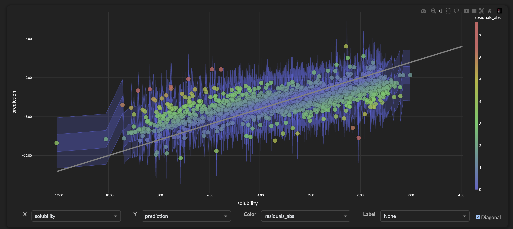
  <figcaption><em>Prediction Intervals: Traditional regression plot (target vs prediction) is noisy and hard to interpret </em></figcaption>
</figure>

Flipping the axes—with prediction on the X-axis and target on the Y-axis—transforms the prediction intervals into clean horizontal bands. This makes it straightforward to visually assess which targets fall within the 50% and 95% intervals versus those that lie outside the prediction bounds.

<figure>
  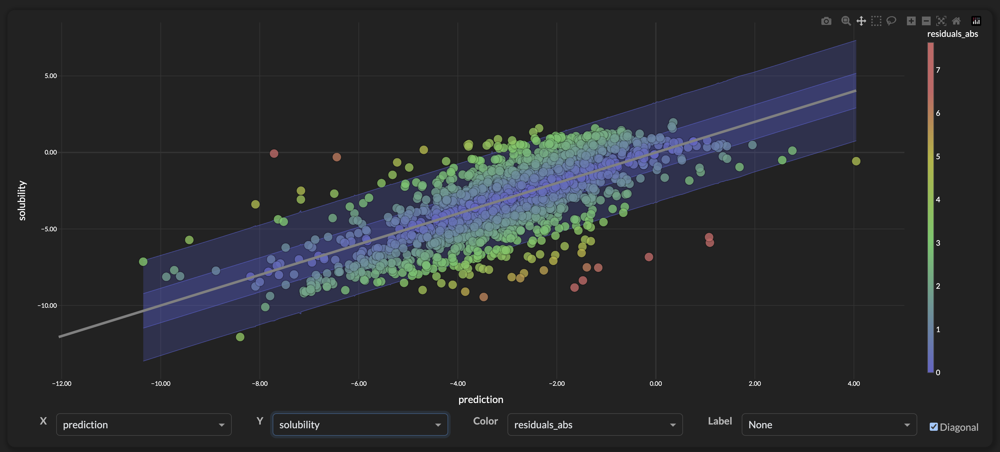
  <figcaption><em>Prediction Intervals: Simply flipping the axes (prediction vs target) allows the plot to show where the targets fall within the prediction intervals</em></figcaption>
</figure>

***All plots were done using Plotly [6][7]***


## Bayesian Ridge
As mentioned above the Bayesian Ridge algorithm assumes homoscedastic noise, which does not provide the row-level confidence differentiation needed for individual inference results. We can see that our coverage looks pretty good, but the intervals are quite wide, much wider than any other algorithm. 

```
=== Bayesian UQ Evaluation ===
Coverage @ 95%: 0.953 (target: 0.950)
Coverage @ 50%: 0.544 (target: 0.500)
Uncertainty-Error Correlation: 0.409
Average 95% Interval Width: 6.494
Average 50% Interval Width: 2.233
Samples: 1996
```

The plot below shows how the Bayesian Ridge algorithm assumes linear relationships and homoscedastic noise, so we get a global stddev of 1.65 applied over almost all the compound. For our use case where the molecular properties have complex non-linear patterns and heteroscedastic uncertainty this algorithm might.

<figure>
  
  <figcaption><em>Bayesian Ridge: Evaluation on Test Set (1996 compounds). Color: abs(residuals)</em></figcaption>
</figure>

<figure>
  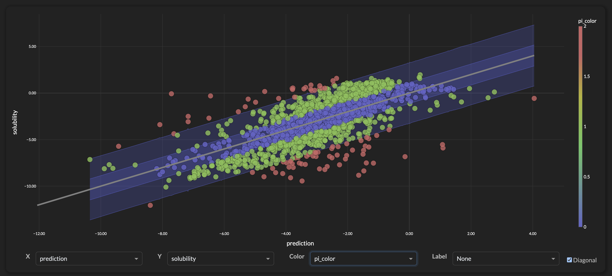
  <figcaption><em>Bayesian Ridge: Evaluation on Test Set (1996 compounds). Color: Prediction Intervals</em></figcaption>
</figure>

### Hyperparmeter changes don't help
I tried several different variations of hyperparameters but there was no improvements, I think given the nature of the algorithm that getting all/most of `prediction_std` values being the same is expected.

```
model = BayesianRidge(
    alpha_1=1e-6, alpha_2=1e-6,  # Noise precision
    lambda_1=1e-6, lambda_2=1e-6,  # Weight precision
    fit_intercept=True,
)
```

## Gaussian Process
### Kernel and Alpha Parameters
So looking up the documetation it appears that we should use the `WhiteKernel()` as part of our kernel to model noise across feature space. Also the default alpha parameter assumes almost no noise at all and that we should set this alpha parameter to something reasonable given the distribution and variance of the target variable. In particular, setting it to something around 10% of the variance of the target variable.

**First Hyperparmeters**

```
kernel = RBF() + WhiteKernel()

# Create and train the Regression/Confidence model
model = GaussianProcessRegressor(
    kernel=kernel,
    alpha=0.56,
)
```

The Gaussian Process algorithm has the same main shortcoming as Bayesian Ridge regarding homoscedastic noise assumptions. While coverage results are slightly lower than Bayesian Ridge, the prediction intervals are considerably narrower. This trade-off between coverage and interval width is often desirable in uncertainty quantification—tighter intervals that still capture most of the true values provide more actionable uncertainty estimates. Overall, this likely makes the Gaussian Process a superior uncertainty quantification model for this application.

```
=== Gaussian UQ Evaluation ===
Coverage @ 95%: 0.930 (target: 0.950)
Coverage @ 50%: 0.584 (target: 0.500)
Uncertainty-Error Correlation: 0.252
Average 95% Interval Width: 4.239
Average 50% Interval Width: 1.458
Samples: 1996
```
<figure>
  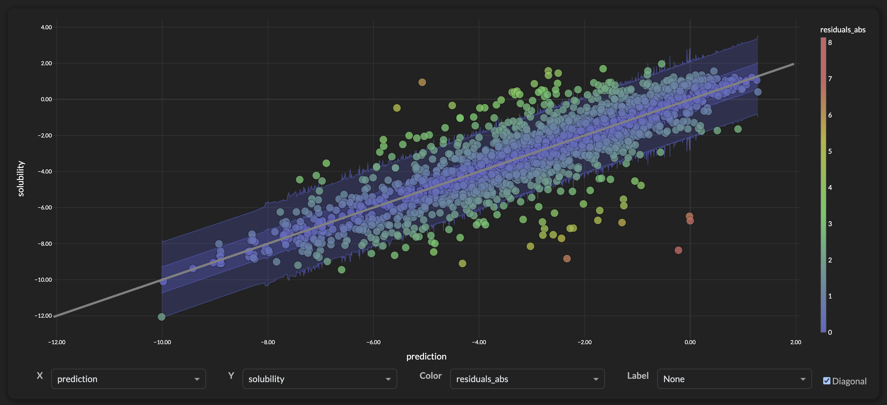
  <figcaption><em>Gaussian Process: Evaluation on Test Set (1996 compounds)</em></figcaption>
</figure>

**Second Hyperparameters**

As with many of the algorithms, I tried a different set of parameters that should allow more flexibility but utimately didn't seem to make much difference.

```
kernel = Matern(nu=2.5, length_scale_bounds=(1e-2, 1e2)) 
             + WhiteKernel(noise_level_bounds=(1e-5, 1e1))

# Create and train the Regression/Confidence model
model = GaussianProcessRegressor(
    kernel=kernel,
    alpha=1e-10,  # Minimal alpha for numerical stability only
)
```
The second set of Hyperparameters actually seems to make things worse. The coverage metrics are further from their targets and the interval widths are larger. Also there's some 'wiggles' in the interval widths but nothing substantially different.

```
=== Gaussian (Params 2) UQ Evaluation ===
Coverage @ 95%: 0.940 (target: 0.950)
Coverage @ 50%: 0.607 (target: 0.500)
Uncertainty-Error Correlation: 0.235
Average 95% Interval Width: 4.512
Average 50% Interval Width: 1.552
Samples: 1996
```

<figure>
  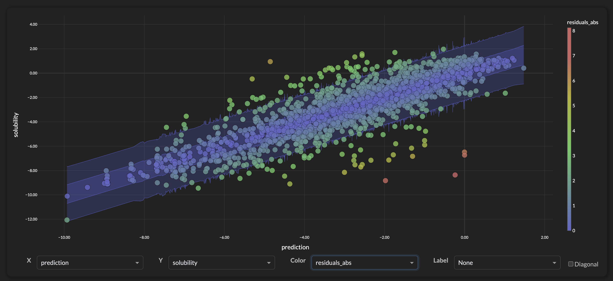
  <figcaption><em>Gaussian Process (Params 2): Evaluation on Test Set (1996 compounds)</em></figcaption>
</figure>

## MAPIE (Model Agnostic Prediction Interval Estimator)

MAPIE coverage results are fairly good, and the prediction intervals are similar to the Gaussian Process. However, MAPIE shows much better uncertainty-error correlation (0.421 vs 0.252), meaning the uncertainty estimates are more reliable indicators of when predictions might be incorrect. Additionally, unlike the previous models, MAPIE provides heteroscedastic uncertainty quantification—the prediction intervals can vary based on the input features rather than assuming constant noise levels across all predictions.

```
=== MAPIE UQ Evaluation ===
Coverage @ 95%: 0.940 (target: 0.950)
Coverage @ 50%: 0.595 (target: 0.500)
Uncertainty-Error Correlation: 0.421
Average 95% Interval Width: 4.385
Average 50% Interval Width: 1.508
Samples: 1996
``` 

<figure>
  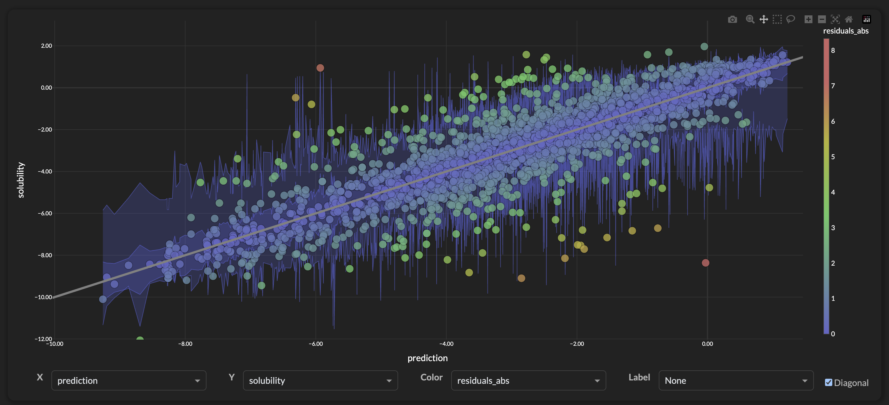
  <figcaption><em>MAPIE: Evaluation on Test Set (1996 compounds)</em></figcaption>
</figure>

## NGBoost
NGBoost shows good coverage results and delivers fairly narrow prediction intervals. The uncertainty-error correlation is fairly good (0.469), indicating reliable uncertainty estimates that identify when predictions are likely to be incorrect. Like MAPIE, NGBoost naturally provides heteroscedastic uncertainty quantification, learning how prediction uncertainty varies across different regions of the input space. The combination of tight intervals and uncertainty-error correlation makes NGBoost a good option for noisy use cases.

```
=== NGBoost UQ Evaluation ===
Coverage @ 95%: 0.925 (target: 0.950)
Coverage @ 50%: 0.473 (target: 0.500)
Uncertainty-Error Correlation: 0.469
Average 95% Interval Width: 3.768
Average 50% Interval Width: 1.297
Samples: 1996
```

<figure>
  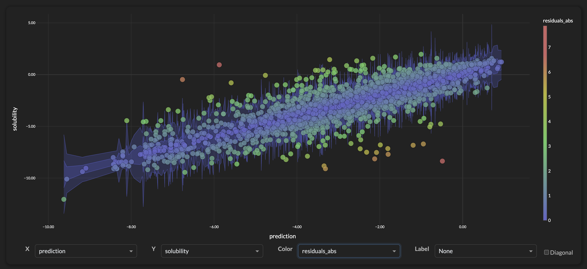
  <figcaption><em>NGBoost: Evaluation on Test Set (1996 compounds)</em></figcaption>
</figure>

## Quantile Regressor
The set of Quantile Regressor models `[q_025, q_25, q_50, q_75, q_975]` have similar prediction interval widths as the NGBoost model but don't have as much coverage. Looking at the plot we can see that the interval widths 'flair out' at the tails which is a known issue, also the correlation between prediction_std and abs(residual) is weaker. 

[Quantile Regressor](https://github.com/brifordwylie/aws_ml_engineer_capstone/blob/main/model_scripts/quant_regression/quant_regression.py).

```
=== Quantile Regressor UQ Evaluation ===
Coverage @ 95%: 0.901 (target: 0.950)
Coverage @ 50%: 0.404 (target: 0.500)
Uncertainty-Error Correlation: 0.351
Average 95% Interval Width: 3.865
Average 50% Interval Width: 1.065
Samples: 1996
```

<figure>
  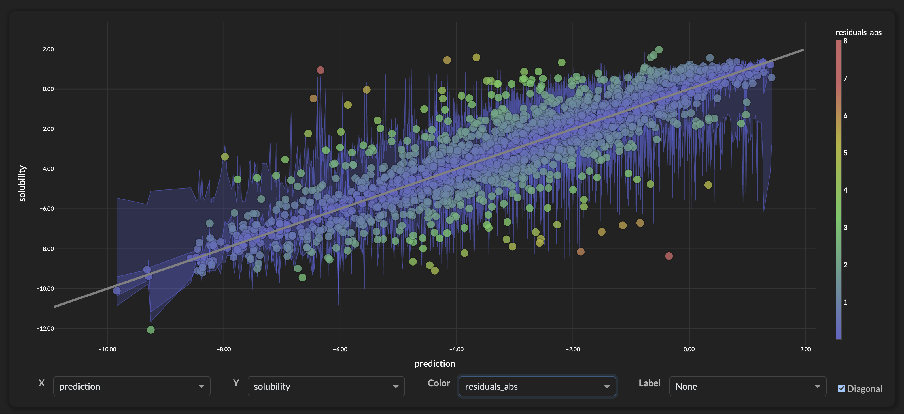
  <figcaption><em>NGBoost: Evaluation on Test Set (1996 compounds)</em></figcaption>
</figure>


## Bootstrap Ensemble
My expectation was that the bootstrap ensemble models (50 models) would be one of the top performers. The results show great results for correlation and interval widths but terrible coverage metrics. The poor performance in coverage makes the model almost useless, so I put in effort on additional functionality around adding calibration metrics and tuning the number of models and sample rates.

The following metrics and plots, show the progresssion.

- First Model Script: [ensemble_bootstrap](https://github.com/brifordwylie/aws_ml_engineer_capstone/blob/main/model_scripts/ensemble_xgb/ensemble_xgb.py).
- Final Model Script: [[ensemble_with_calibration](https://github.com/brifordwylie/aws_ml_engineer_capstone/blob/main/model_scripts/ensemble_xgb/ensemble_with_calibration.py).

```
=== Bootstrap Ensemble UQ Evaluation ===
Coverage @ 95%: 0.658 (target: 0.950)
Coverage @ 50%: 0.278 (target: 0.500)
Uncertainty-Error Correlation: 0.800
Average 95% Interval Width: 1.686
Average 50% Interval Width: 0.676
Samples: 1996

```

<figure>
  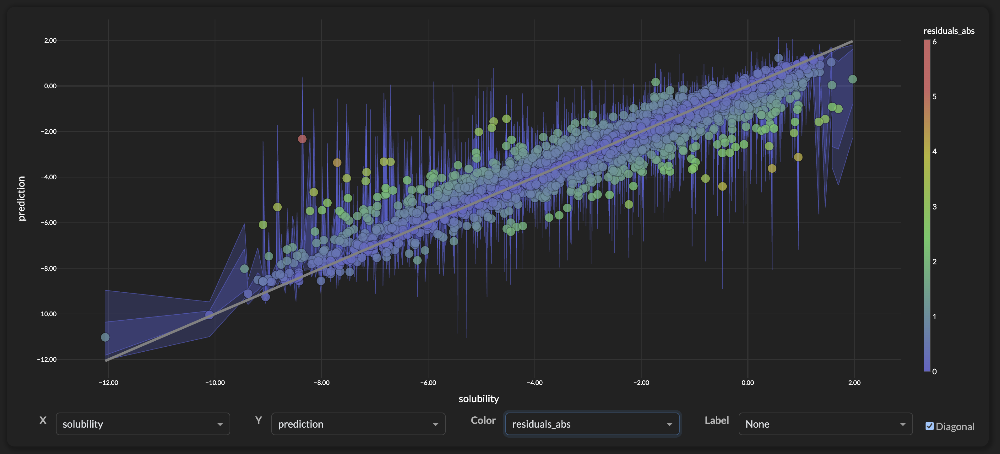
  <figcaption><em>Bootstrap Ensemble: Evaluation on Test Set (1996 compounds)</em></figcaption>
</figure>


<figure>
  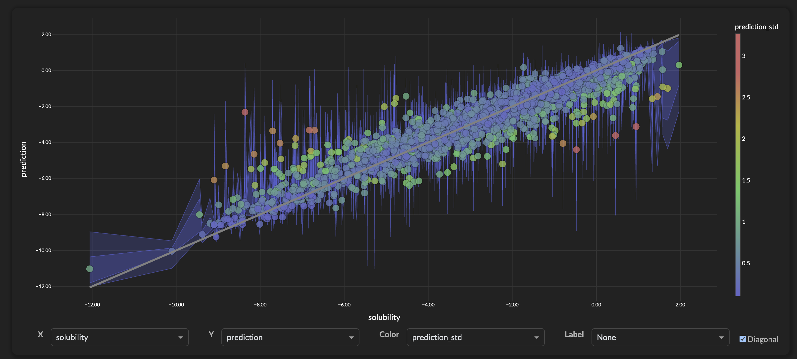
  <figcaption><em>Bootstrap Ensemble: High Correlation between prediction_std and abs(residuals)</em></figcaption>
</figure>

### Adding Calibration Computation

```
=== Bootstrap Ensemble UQ (with Calibration) Evaluation ===
Coverage @ 95%: 0.670 (target: 0.950)
Coverage @ 50%: 0.277 (target: 0.500)
Uncertainty-Error Correlation: 0.804
Average 95% Interval Width: 1.688
Average 50% Interval Width: 0.678
Samples: 1996
```

<figure>
  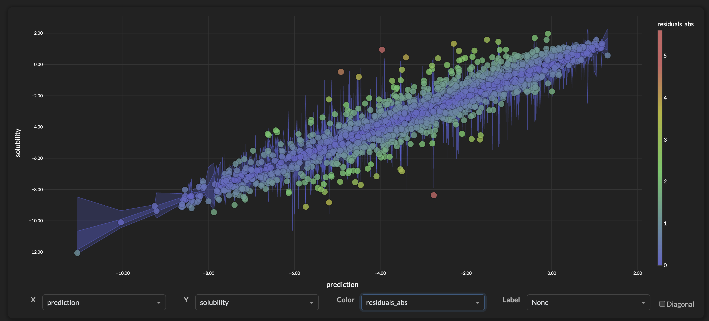
  <figcaption><em>Bootstrap Ensemble: Addition of two calibration parameters has only minimual improvement</em></figcaption>
</figure>

### More Models (100) + Smaller Samples per Model (10%)

```
=== Bootstrap Ensemble UQ Evaluation ===
Coverage @ 95%: 0.806 (target: 0.950)
Coverage @ 50%: 0.340 (target: 0.500)
Uncertainty-Error Correlation: 0.733
Average 95% Interval Width: 2.426
Average 50% Interval Width: 0.846
Samples: 1996
```

<figure>
  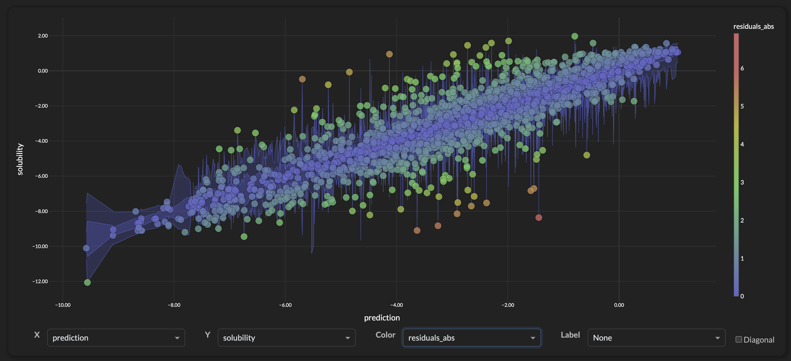
  <figcaption><em>Bootstrap Ensemble: Addition of two calibration parameters has only minimual improvement</em></figcaption>
</figure>

### Bootstrap Ensemble Coverage Limitation
While our calibrated bootstrap ensemble significantly improved uncertainty quantification, we basically hit a wall around 80% coverage for 95% confidence intervals. Bootstrap methods are known to struggle with coverage on skewed data, the core problem is that the bootstrap ensemble tend to underestimate extreme observations and don't give an accurate estimate of uncertainty.

## Wrap-Up
We used AWS Sagemaker to develop, train, deploy, and compare a large set of Uncertainly Quantification Models. The models represented a broad range of approaches and required additional Python libraries (Scikit-Learn, NGBoost, MAPIE, XGBoost). [Model Scripts](https://github.com/brifordwylie/aws_ml_engineer_capstone/blob/main/model_scripts)

All the models had various strengths and weaknesses but given our use case and the performance metrics here's a ranked list for their effectiveness on the AQSol public data.

- [NGBoost](https://github.com/brifordwylie/aws_ml_engineer_capstone/blob/main/model_scripts/ngboost) (Best Overall)
- [MAPIE](https://github.com/brifordwylie/aws_ml_engineer_capstone/blob/main/model_scripts/mapie_xgb) (Best Coverage)
- [Quantile Regressor](https://github.com/brifordwylie/aws_ml_engineer_capstone/blob/main/model_scripts/quant_regression/quant_regression.py).
- [Bootstrap Ensemble](https://github.com/brifordwylie/aws_ml_engineer_capstone/blob/main/model_scripts/ensemble_xgb/ensemble_with_calibration.py)
- [Gaussian Process](https://github.com/brifordwylie/aws_ml_engineer_capstone/blob/main/model_scripts/gaussian_process/gaussian_process.py)
- [Bayesian Rdige](https://github.com/brifordwylie/aws_ml_engineer_capstone/blob/main/model_scripts/bayesian_ridge/bayesian_ridge.py)
