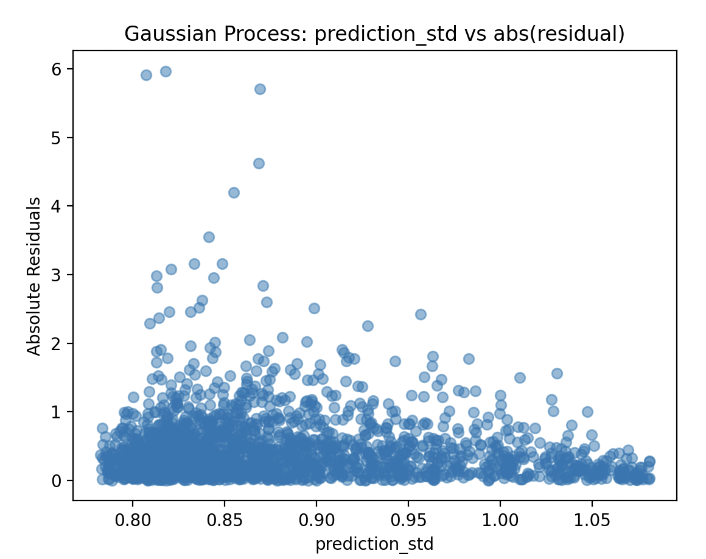

# Results

We're going to look at both the correlation of the output of the model with the abs(residual) of the prediction. For the results we're going to use code similar to this for each model.

```python
# Check correlation between uncertainty and prediction errors
correlation = df[['prediction_std', 'residuals_abs']].corr().iloc[0,1]
print(f"Bayesian Ridge: Correlation (prediction_std/absolute residuals): {correlation:.3f}")

# Scatter plot
plt.scatter(df['prediction_std'], df['residuals_abs'], alpha=0.5)
plt.xlabel('prediction_std')
plt.ylabel('Absolute Residuals')
plt.title('Bayesian Ridge: prediction_std vs abs(residual)')
plt.show()
```

## Bayesian Ridge
As mentioned above the Bayesian Ridge algorithm assumes homoscedastic noise, this may not provide the row-level confidence differentiation needed for individual inference results. We can see that our correlation isn't great and looking at the scatter plot the results looks even worse.

```
Bayesian Ridge: Correlation prediction_std/abs(residuals): 0.281
```

<figure>
  
  <figcaption><em>Bayesian Ridge: Correlation between prediction_std and abs(residuals)</em></figcaption>
</figure>

```
Correlation between prediction_std and absolute residuals: 0.281
```

### Hyperparmeter changes don't help
I tried several different variations of hyperparameters but there was no improvements, I think given the nature of the algorithm that getting all/most of `prediction_std` values being the same is expected.

```
model = BayesianRidge(
    alpha_1=1e-6, alpha_2=1e-6,  # Noise precision
    lambda_1=1e-6, lambda_2=1e-6,  # Weight precision
    fit_intercept=True,
)
```

## Gaussian Process
### Kernel and Alpha Parameters
So looking up the documetation it appears that we should use the `WhiteKernel()` as part of our kernel to model noise across feature space. Also the default alpha parameter assumes almost no noise at all and that we should set this alpha parameter to something reasonable given the distribution and variance of the target variable. In particular, setting it to something around 10 * variance of the target variable.

```
kernel = RBF() + WhiteKernel()

# Create and train the Regression/Confidence model
model = GaussianProcessRegressor(
    kernel=kernel,
    alpha=0.56,
)
```

```
Gaussian Process: Correlation (prediction_std/absolute residuals): 0.133
```
<figure>
  
  <figcaption><em>Gaussian Process: Correlation between prediction_std and abs(residuals)</em></figcaption>
</figure>

The results look fairly bad, the correlation is close to zero and we're getting higher residuals for lower values of the `prediction_std` value. I also tried changing the kernel from RBF() to Matern() with various value of `nu` but there was no significant improvement in the results.


## Quantile Regressor

```
Correlation between Quantile Regression (IDR) and absolute residuals: 0.269
```

## NGBoost
<description here>

```
     MAE   RMSE     R2     MAPE  MedAE  NumRows
0  0.845  1.178  0.754  144.055  0.631     1996
Correlation between prediction_std and absolute residuals: 0.487

After Hyperparameter adjust ments

Performance Metrics for aqsol-ngboost-reg on aqsol-ngboost-reg
     MAE   RMSE     R2     MAPE  MedAE  NumRows
0  0.809  1.126  0.775  133.872  0.589     1996

Correlation between prediction_std and absolute residuals: 0.551


```
